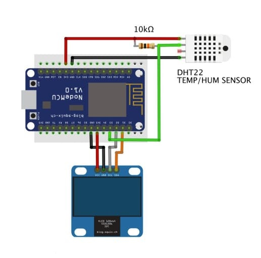

# ESP8266 Firmware - Oled Temperature Measurement

This is a very simple project using DHT11/DHT22 sensor sending temperature and humidity to middleware platform and also showing the data an OLED IC2 screen:

The development enviroment used was the [PlaftormIO](https://docs.platformio.org/en/latest/), a cross-platform, cross-architecture, multiple framework, professional tool for embedded systems engineers and for software developers who write applications for embedded products. Without going too deep into PlatformIO implementation details, work cycle of the project developed using PlatformIO is as follows:

- Users choose board(s) interested in “platformio.ini” (Project Configuration File)
- Based on this list of boards, PlatformIO downloads required toolchains and installs them automatically.
- Users develop code and PlatformIO makes sure that it is compiled, prepared and uploaded to all the boards of interest.

The firmware execution cycle works basically on:

- Check WiFi connection
- Connect to a middleware (local or cloud) platform via MQTT  
- Continuous temperature measurement using a DHT11/DHT22 sensor
- Send the data collected to the platform
